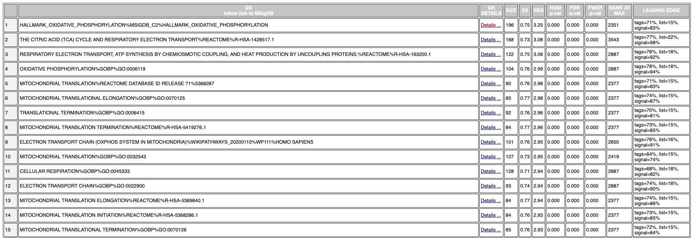
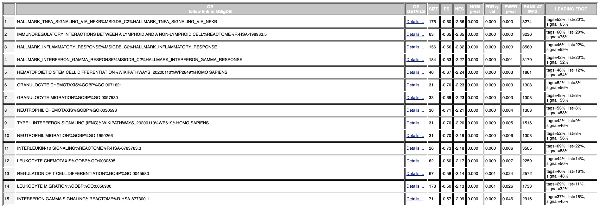
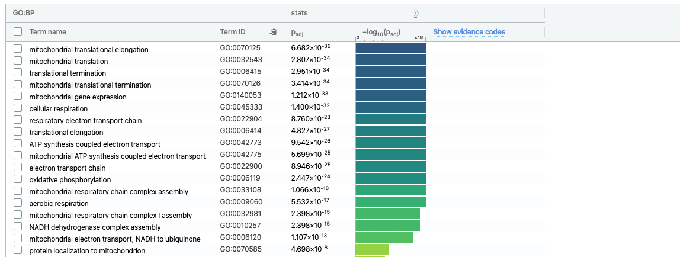
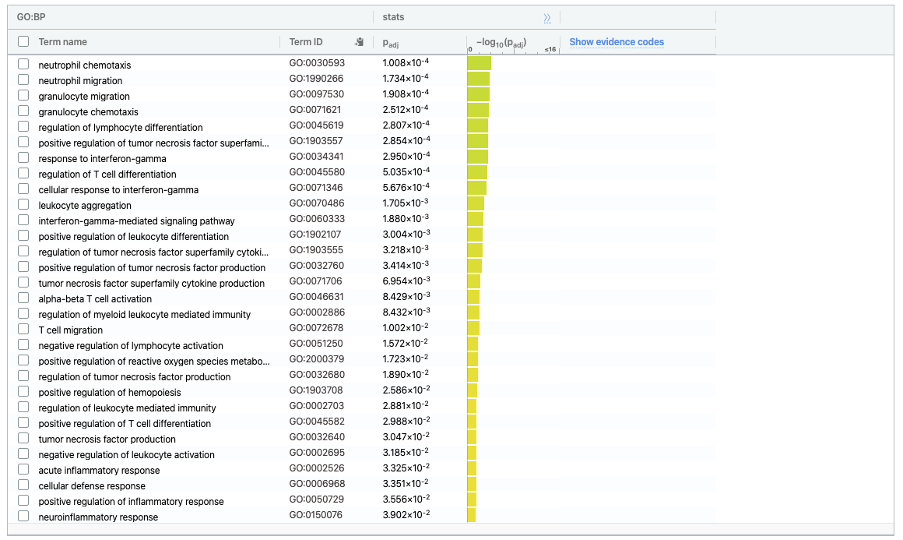
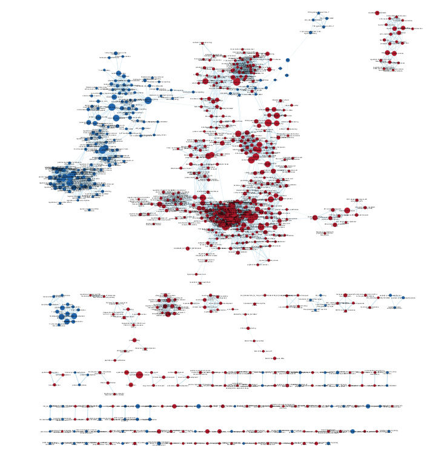
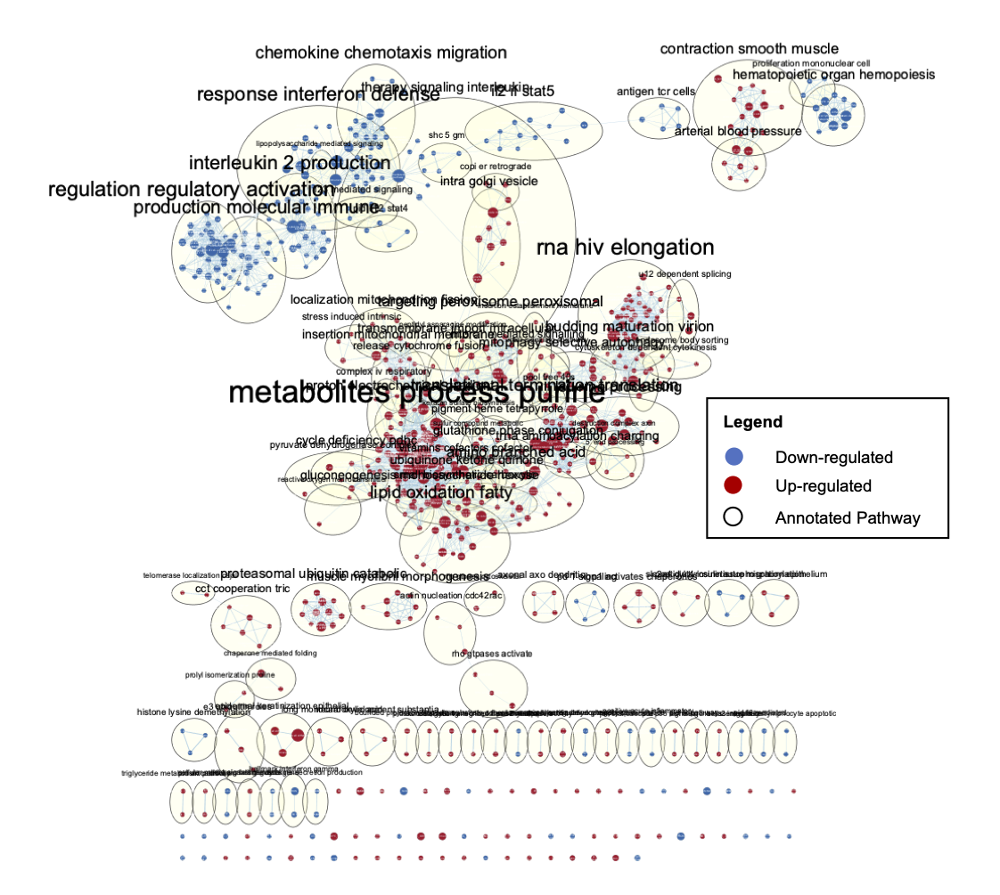
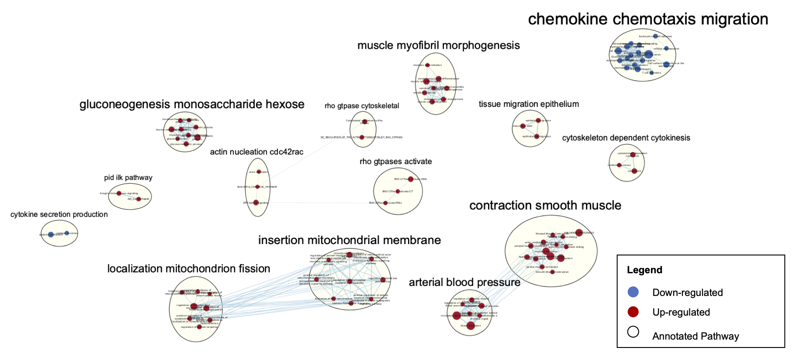

# __Introduction__

The dataset I have selected, "Using RNA sequencing to examine age-dependent skeletal muscle transcriptome response to bed rest-induced atrophy, and age independent disuse-induced insulin resistance" (GSE113165), records the transcriptome of vastus lateralis cells of YOUNG (N=9, 18-28 y) and OLD (N=18, 60-79 y) men and women before five days of bed rest (control) and after five days of bed rest (test condition). The subjects are also classified into susceptability (i.e. low, high) to disuse-induced insulin resistance. The study aims to understand gene expression associated with bed rest to offset resulting muscle loss.

In the first previous assessment in this course BCB420, Assignment 1, the dataset was processed - cleaned for low counts, normalized using TMM (Trimmed Mean of M-Values) and mapped to HUGO identifiers. Duplicate HUGO ids were averaged and genes with empty/unavailable HUGO ids were removed. The initial downloaded GEO dataset contained 58051 gene ids, however the final processed dataset, contained 14969 gene ids. Next, in Assignment 2, the cleaned dataset was used to rank the gene set based on significant differential expression, using edgeR.

# __Assignment 3 Contents__

## Non-thresholded Gene set Enrichment Analysis

First we download the Bader lab genesets:

```{r download_pathways, message=FALSE, results='hide'}
gmt_url = "http://download.baderlab.org/EM_Genesets/current_release/Human/symbol/"
# list all the files on the server
filenames = RCurl::getURL(gmt_url)
tc = textConnection(filenames)
contents = readLines(tc)
close(tc)
# get the gmt that has all the pathways and does not include terms inferred from
# electronic annotations(IEA) start with gmt file that has pathways only
rx = gregexpr("(?<=<a href=\")(.*.GOBP_AllPathways_no_GO_iea.*.)(.gmt)(?=\">)", contents, 
    perl = TRUE)
gmt_file = unlist(regmatches(contents, rx))
dest_gmt_file <- file.path(gmt_file)
download.file(paste(gmt_url, gmt_file, sep = ""), destfile = dest_gmt_file)
```

The Bader lab February 01, 2020 Human geneset was downloaded, which contains GO:BP data.


This is the gene ranking file corrsponding to results from Assignment 2 (I had to do some adjustments to the code, then produced this ranking file, see wiki for details):

```{r import_rankings}
#Load ranked genes from Assignment 2
(rankings <- read.table(file=file.path("data", "rankings.rnk"),
                                    header = TRUE,sep = "\t",
                                    stringsAsFactors = FALSE,
                                    check.names=FALSE))
```

__1. What method did you use? What genesets did you use? Make sure to specify versions and cite your methods.__

The rankings.rnk and Bader geneset collection are used to perform a non-thresholded pathway analysisusing GSEA version 4.0.3. Default geneset size of 15-500 with 1000 permutations is used. Gene symbols are set to "No_Collapse." 

__2. Summarize your enrichment results.__

The top 15 upregulated pathways as indicated by GSEA are:



The top 15 downregulated pathways as indicated by GSEA are:



__3. How do these results compare to the results from the thresholded analysis in Assignment #2. Compare qualitatively. Is this a straight forward comparison? Why or why not?__

Following the Assignment 2 adjustments, the lists of upregulated and downregulated genes were each run through g:profiler with terms sizes between 5-200.

```{r show_upregulated}
#Show upregulated genes from adjusted Assignment 2 results
(upreg <- read.table(file=file.path("data", "upregulated_genes.txt"),
                                    header = FALSE,sep = "\t",
                                    stringsAsFactors = FALSE,
                                    check.names=FALSE))
```

```{r show_downregulated}
#Show downregulated genes from adjusted Assignment 2 results
(downreg <- read.table(file=file.path("data", "downregulated_genes.txt"),
                                    header = FALSE,sep = "\t",
                                    stringsAsFactors = FALSE,
                                    check.names=FALSE))
```

With a quick scan of the biological processes/pathways in the GSEA (non-thresholded analysis) and g:profiler (thresholded analysis) results, it is evident that is there strong similarity. 

Below is the GO:BP results from the upregulated genes.


The top pathways upregulated in the samples are related to mitochondrial translation, amongst other processes, which are reflected in both thresholded and non-thresholded analysis. This is also supported by the findings of the paper, in which "Mitochondrial Dysfunction" was determined as one of the top commonly regulated pathways in Young and Old subjects. 


Below is the GO:BP results from the upregulated genes.



The top pathways downregulated in the samples are related to inflammatory and immunity related cell migration and response. This is supported by findings of the paper in the regulation of the Hepatic Fibrosis/Hepatic Stellate Cell Activation pathway, which mediated inflammatory signalling. 

## Visualize your Gene set Enrichment Analysis in Cytoscape

__1. Create an enrichment map - how many nodes and how many edges in the resulting map? What thresholds were used to create this map? Make sure to record all thresholds. Include a screenshot of your network prior to manual layout.__

The GSEA output was use with the EnrichmentMap App in Cytoscape Version: 3.7. The Q-value used was 0.1 and then default Edge Cutoff was used (0.375). As seen below, the resulting network was quite large (767 nodes and 4824 edges), so we must filter our view to relevant clusters. Note: I originally used a Q-value of 0.05, however, the annotations were more specific with 0.1, so I decided to keep this cut off, despite the larger amount of nodes and edges.



__2. Annotate your network - what parameters did you use to annotate the network. If you are using the default parameters make sure to list them as well.__

The AutoAnnotate Cytoscape App was used to annotate the above EnrichmentMap, the default selection of MCL CLuster algorithm was used, and the "Layout network to prevent cluster overlap" was selected for network readability. 204 annotations were produced.

__3. Make a publication ready figure - include this figure with proper legends in your notebook.__




__4. Collapse your network to a theme network. What are the major themes present in this analysis? Do they fit with the model? Are there any novel pathways or themes?__

The resulting network was still quite large, so with manual selection, the resulting clusters and corresponding annotations were displayed:



As we can see, confirming our comparison between non-thresholded and thresholded analysis, mitochondrial pathways are upregulated, as well as inflammatory response pathways are downregulated. We also see other pathways that were not within the top GSEA results, including regulated pathways related to Rho signaling, Actin Cytoskeleton signaling, Glucocorticoid Receptor signaling and ILK signaling - all of which are supported by the top regulated pathways within findings of the paper when comparing muscle cell transcriptome before and after bed rest.

## Interpretation and detailed view of results

We can also look at the Dark Matter to see if there are significant genes that are not annotated and thus not seen in our enrichment analysis.

```{r assess_dark_matter, message=FALSE, results='hide'}
if (!requireNamespace("GSA", quietly = TRUE))
  install.packages("GSA")

library(GSA)

#Load in the Bader lab gene set
gmt_file <- file.path("Human_GOBP_AllPathways_no_GO_iea_April_01_2020_symbol.gmt")
capture.output(genesets<- GSA::GSA.read.gmt(gmt_file),file="gsa_load.out")
names(genesets$genesets) <- genesets$geneset.names

#Load in normalized and cleaned expression data from A1
expression <- read.table(file.path(getwd(),"data",
                         "normalized_counts.txt"), 
                         header = TRUE, sep = "\t", quote="\"",  
                         stringsAsFactors = FALSE)

#Load in ranked genes from A2
ranks <- read.table(file.path(getwd(),"data","rankings.rnk"), 
                    header = TRUE, sep = "\t", quote="\"",  
                    stringsAsFactors = FALSE)

#Get all the GSEA directories
gsea_directories <- list.files(path = file.path(getwd(),"data"), 
                                 pattern = "\\.GseaPreranked")

#Load GSEA results files
if(length(gsea_directories) == 1){
  gsea_dir <- file.path(getwd(),"data",gsea_directories[1])
  #get the gsea result files
  gsea_results_files <- list.files(path = gsea_dir, 
                                 pattern = "gsea_report_*.*.xls")
  #there should be 2 gsea results files
  enr_file1 <- read.table(file.path(gsea_dir,gsea_results_files[1]), 
                        header = TRUE, sep = "\t", quote="\"",  
                        stringsAsFactors = FALSE,row.names=1)
  enr_file2 <- read.table(file.path(gsea_dir,gsea_results_files[1]), 
                        header = TRUE, sep = "\t", quote="\"",  
                        stringsAsFactors = FALSE,row.names=1)
}

#get the genes from the set of enriched pathwasy (no matter what threshold)
all_enr_genesets<- c(rownames(enr_file1), rownames(enr_file2))
genes_enr_gs <- c()

for(i in 1:length(all_enr_genesets)){
  current_geneset <- unlist(genesets$genesets[which(genesets$geneset.names %in% all_enr_genesets[i])]) 
  genes_enr_gs <- union(genes_enr_gs, current_geneset)
}

FDR_threshold <- 0.001
#get the genes from the set of enriched pathways (no matter what threshold)
all_sig_enr_genesets<- c(rownames(enr_file1)[which(enr_file1[,"FDR.q.val"]<=FDR_threshold)], rownames(enr_file2)[which(enr_file2[,"FDR.q.val"]<=FDR_threshold)])
genes_sig_enr_gs <- c()
for(i in 1:length(all_sig_enr_genesets)){
  current_geneset <- unlist(genesets$genesets[which(genesets$geneset.names %in% all_sig_enr_genesets[i])]) 
  genes_sig_enr_gs <- union(genes_sig_enr_gs, current_geneset)
}

genes_all_gs <- unique(unlist(genesets$genesets))

genes_no_annotation <- setdiff(expression[,2], genes_all_gs)

ranked_gene_no_annotation <- ranks[which(ranks[,1] %in% genes_no_annotation),]
```

The top 10 ranked dark matter genes:

```{r top10_dark_matter}
ranked_gene_no_annotation[1:10,]
```

The top dark matter gene is RN7SL630P, which according to GeneCards RNA, 7SL, Cytoplasmic 630, Pseudogene. There are minimal available information on this gene and its orthologs. Let's move onto visualization instead of attempting to infer function.


```{r produce_heatmap, message=FALSE, results='hide'}
if (!requireNamespace("ComplexHeatmap")) {
  BiocManager::install("ComplexHeatmap")
}
if (!requireNamespace("circlize")) {
  install.packages("circlize")
}


#Create numerical matrix to produce a heatmap plot
heatmap_matrix_tophits <- expression[expression[,2] %in% ranked_gene_no_annotation[,1],]
rownames(heatmap_matrix_tophits) <- heatmap_matrix_tophits[,1]
heatmap_matrix_tophits <- heatmap_matrix_tophits[,3:58]

heatmap_matrix_tophits <- t(scale(t(heatmap_matrix_tophits)))

#Grouping samples based on time condition (i.e. pre or post 5 days of bed rest) and susceptability to disuse-induced insulin resistance (i.e. low, high, if available)
heatmap_matrix_tophits<- heatmap_matrix_tophits[,
                                                c(grep(colnames(heatmap_matrix_tophits),pattern = "pre\\_low"),
                                                  grep(colnames(heatmap_matrix_tophits),pattern = "pre\\_high"),
                                                  grep(colnames(heatmap_matrix_tophits),pattern = "pre$"),
                                                  grep(colnames(heatmap_matrix_tophits),pattern = "post\\_low"),
                                                  grep(colnames(heatmap_matrix_tophits),pattern = "post\\_high"),
                                                  grep(colnames(heatmap_matrix_tophits),pattern = "post$"))]

if(min(heatmap_matrix_tophits) == 0){
  heatmap_col = circlize::colorRamp2(c( 0, max(heatmap_matrix_tophits)), 
                           c( "white", "red"))
} else {
  heatmap_col = circlize::colorRamp2(c(min(heatmap_matrix_tophits), 0, max(heatmap_matrix_tophits)), c("blue", "white", "red"))
}

#Create and display heatmap
dark_matter_heatmap <- ComplexHeatmap::Heatmap(as.matrix(heatmap_matrix_tophits),
                           cluster_rows = TRUE,
                           cluster_columns = FALSE,
                           show_row_dend = TRUE,
                           show_column_dend = FALSE, 
                           col=heatmap_col,
                           show_column_names = TRUE, 
                           show_row_names = FALSE,
                           show_heatmap_legend = TRUE,
)
```

```{r display_heatmap}
dark_matter_heatmap
```

We can see that the heatmap has most of its obvious clustering with the old subjects, which also have subtle changes in the pre- and post- bed rest expression.

__1. Do the enrichment results support conclusions or mechanism discussed in the original paper? How do these results differ from the results you got from Assignment #2 thresholded methods__

The top-ranking pathway in the study group was "the Hepatic Fibrosis/Hepatic Stellate Cell Activation Pathway", as edfined in the paper. This is supported by the cytokines pathways/processes that are represented the cluster annotations. The paper also highlights increasing attention towrads the importance of cell adhesion processes for regulation of skeletal muscle mass, that is supported by the Rho signaling, Actin Cytoskeleton signaling, and ILK signaling that can be observed in the Enrichment results. Comparing the thresholded analysis results run in g:profiler to the non-thresholded results in GSEA and enrichment+annotation results from Cytoscape, all the results seem to support each other.

__2. Can you find evidence, i.e. publications, to support some of the results that you see. How does this evidence support your result?__

A study by Fredriksson et al. showed that impaired muscle mitochondrial enzyme activities results in inference with muscle funcntion and metabolism. [8] In addition, the paper also highlights that studies have also demonstrated the link between "increased muscle fibrosis with aging and increased inflammatory signaling." [9,10]

## References
[1] Robinson MD, McCarthy DJ, Smyth GK (2010). “edgeR: a Bioconductor package for differential expression analysis of digital gene expression data.” Bioinformatics, 26(1), 139-140. doi: 10.1093/bioinformatics/btp616.

[2] McCarthy DJ, Chen Y, Smyth GK (2012). “Differential expression analysis of multifactor RNA-Seq experiments with respect to biological variation.” Nucleic Acids Research, 40(10), 4288-4297. doi: 10.1093/nar/gks042.

[3] Mahmassani ZS, Reidy PT, McKenzie AI, Stubben C et al. Age-dependent skeletal muscle transcriptome response to bed rest-induced atrophy. J Appl Physiol (1985) 2019 Apr 1;126(4):894-902. PMID: 30605403

[4] Mahmassani ZS, Reidy PT, McKenzie AI, Stubben C et al. Disuse-induced insulin resistance susceptibility coincides with a dysregulated skeletal muscle metabolic transcriptome. J Appl Physiol (1985) 2019 May 1;126(5):1419-1429. PMID: 30763167

[5] Isserlin R, BCB420-lectures-public, (2020), GitHub repository, https://github.com/risserlin/BCB420-lectures-public

[6] Subramanian A, Tamayo P, Mootha VK, et al. Gene set enrichment analysis: a knowledge-based approach for interpreting genome-wide expression profiles. Proc Natl Acad Sci U S A. 2005;102(43):15545–15550. doi:10.1073/pnas.0506580102

[7] Reimand J, Kull M, Peterson H, Hansen J, Vilo J. g:Profiler--a web-based toolset for functional profiling of gene lists from large-scale experiments. Nucleic Acids Res. 2007;35(Web Server issue):W193–W200. doi:10.1093/nar/gkm226

[8] Fredriksson K, Tjäder I, Keller P, et al. Dysregulation of mitochondrial dynamics and the muscle transcriptome in ICU patients suffering from sepsis induced multiple organ failure [published correction appears in PLoS ONE. 2008;3(12)doi: 10.1371/annotation/68d951f9-a236-472f-98af-24e4cc4c1a20.]. PLoS One. 2008;3(11):e3686. doi:10.1371/journal.pone.0003686

[9] Peake J, Della Gatta P, Cameron-Smith D. Aging and its effects on inflammation in skeletal muscle at rest and following exercise-induced muscle injury. Am J Physiol Regul Integr Comp Physiol 298: R1485–R1495, 2010. doi:10.1152/ajpregu.00467.2009

[10] Reidy PT, Lindsay CC, McKenzie AI, Fry CS, Supiano MA, Marcus RL, LaStayo PC, Drummond MJ. Aging-related effects of bed rest followed by eccentric exercise rehabilitation on skeletal muscle macrophages and insulin sensitivity. Exp Gerontol 107: 37–49, 2018.

